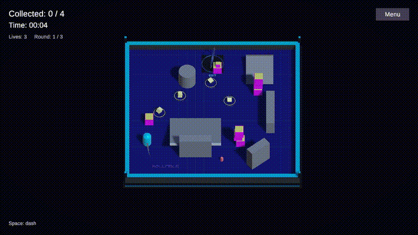

# Big Monster Game

Four cubes, one exit, and a monster that won't leave you alone.

A small Unity arena game about finding a clear route, keeping your distance, and knowing when to dash. Collect every cube to open the exit, then make it there before the monster catches you. There are three rounds, and the chase gets faster each time.

## Playing

You start with three lives. Getting hit costs a life and gives you a short moment of protection. A dash can get you out of a tight corner, but it needs time to recharge. The boxes can be pushed around, so the path you started with may not stay clear.

Quick pickups earn extra points. Finish all three rounds to set a score; your best is saved for the next run.

| Control | Action |
| --- | --- |
| WASD / arrow keys | Move |
| Space | Dash |
| Esc | Pause / resume |
| R, while paused | Restart |

Gamepad controls work too: left stick to move, the bottom face button to dash, and Start to pause.

The menu has separate music and sound-effect switches, a volume slider, and a reduced-effects option. Collection and hit effects stay visible in both modes.

## Open the project

1. Clone or download this repository.
2. Add the project folder to Unity Hub and open it with **Unity 6000.4.9f1**.
3. Let Unity finish importing the assets, then open **Rollable → Open Enhanced Arena**.
4. Press Play in the editor and choose **Play** in the game.

The playable scene is `Assets/RollablePlus/Scenes/Rollable Enhanced.unity`. The earlier version is still included at `Assets/Scenes/Mini Game.unity`.

## Inside the project

Built with Unity, URP, the Input System, and NavMesh. The player uses Rigidbody movement; the monster follows using a NavMeshAgent.

The scene contains the arena, player, enemy, pickups, exit, and UI. Materials, text, sounds, and their scene references can be edited in the Inspector. Gameplay scripts are in `Assets/RollablePlus/Runtime`.
